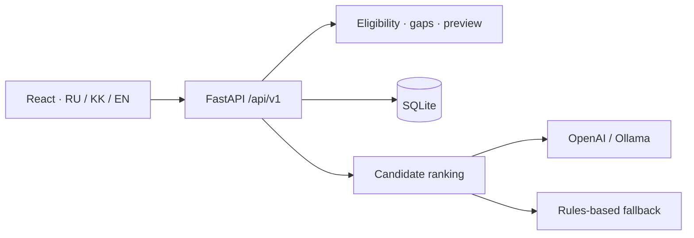

<div align="center">

# SHAGRA · ШАГРА

### See the impact of your next career step

[Русский](README.md) · [Қазақша](README.kk.md) · **English**

React · TypeScript · FastAPI · SQLite · OpenAI / Ollama

HackAlem AI · Halyk Bank track · Team Invincibles

</div>

SHAGRA helps employees choose a useful learning activity, **preview its calculated impact before completing it**, and compare alternatives. HR gets a skills-gap overview and a validated profile import workflow. This is a working hackathon MVP backed by a real API.


[Quick start](#quick-start) · [Installation](#installation-by-platform) · [Data](#data-and-import) · [Architecture](#architecture) · [Testing](#testing) · [Documentation](docs/README.md)

## Features

| Employees | HR |
|---|---|
| Current and target grades, requirements coverage | Team development overview |
| Skill map and specific gaps | Priority gaps with explicit denominators |
| Personalized catalog recommendations | Employee lookup by ID |
| Activity preview and comparison | Participation tables, filters and pagination |
| Completion confirmation and history | File validation before a separate commit |

**RU / KZ / EN**, light and dark themes, desktop and mobile navigation. Language and theme persist in the browser. Catalog translations depend on the available API fields; missing translations use another available language with a notice. Server evidence stays in its source language.

| HR analytics | Mobile |
|---|---|
|  |  |

Screenshots show the working app using synthetic data. The repository contains no real bank employee records.

## Quick start

Install **Git and Docker Compose v2**. Host Python and Node.js are not needed for Docker. The first build downloads dependencies.

```bash
git clone https://github.com/BAITC-Hacks/hack-3e883744-invincibles.git
cd hack-3e883744-invincibles
```

Create `.env` from [.env.example](.env.example) only if it does not already exist.

Linux/macOS:

```bash
test -f .env || cp .env.example .env
```

Windows PowerShell:

```powershell
if (!(Test-Path .env)) { Copy-Item .env.example .env }
```

Set `OPENAI_API_KEY` in `.env` to enable AI. Without a key, the app uses an explicitly labeled rules-based fallback. Never commit the key or place it in `VITE_*` variables.

```bash
docker compose up -d --build app
docker compose ps
```

Open **[localhost:8080](http://localhost:8080)**. [Health endpoint](http://localhost:8080/api/v1/health) · [Swagger UI](http://localhost:8080/docs).

| Account | Username | Password |
|---|---|---|
| Employee, E0001 | `employee` | `demo-employee` |
| HR | `hr` | `demo-hr` |

These are demo accounts. Configure their passwords with `DEMO_EMPLOYEE_PASSWORD` and `DEMO_HR_PASSWORD`.

## Installation by platform

| Platform | Preparation |
|---|---|
| Windows | Install and start [Docker Desktop](https://docs.docker.com/desktop/setup/install/windows-install/) with WSL 2 and Linux containers. Run the quick-start commands in PowerShell. |
| macOS | Install and start [Docker Desktop](https://docs.docker.com/desktop/setup/install/mac-install/) for your Apple silicon or Intel Mac. Use Terminal. |
| Linux | Install Docker Engine and the Compose plugin following the [Ubuntu guide](https://docs.docker.com/engine/install/ubuntu/) or your distribution's instructions. Check `docker info` and `docker compose version`. |

If Linux reports Docker socket permission errors, use `sudo docker compose …` or configure access according to your system policy. Consult the official links for current OS and hardware requirements.

### Without Docker: Linux / macOS

Use **Python 3.12** and **Node.js 22 LTS (22.19 or later in the 22.x series)**. Node.js 24 was also used in local verification. From the repository root:

```bash
python3.12 -m venv .venv
.venv/bin/python -m pip install -r backend/requirements.lock
npm --prefix frontend ci
npm --prefix frontend run build
export DATABASE_PATH="$PWD/runtime/shagra.sqlite3"
export SESSION_SECRET_PATH="$PWD/runtime/session-secret"
export AI_USAGE_PATH="$PWD/runtime/ai-usage.json"
export KIT_PATH="$PWD/data/synthetic"
export FRONTEND_DIST="$PWD/frontend/dist"
export APP_ORIGIN=http://localhost:8080
export AI_PROVIDER=openai
# Set OPENAI_API_KEY in this terminal environment to enable AI.
.venv/bin/python -m uvicorn app.main:app --app-dir backend --host 127.0.0.1 --port 8080
```

### Without Docker: Windows PowerShell

```powershell
py -3.12 -m venv .venv
.\.venv\Scripts\python.exe -m pip install -r backend/requirements.lock
npm --prefix frontend ci
npm --prefix frontend run build
$env:DATABASE_PATH = "$PWD/runtime/shagra.sqlite3"
$env:SESSION_SECRET_PATH = "$PWD/runtime/session-secret"
$env:AI_USAGE_PATH = "$PWD/runtime/ai-usage.json"
$env:KIT_PATH = "$PWD/data/synthetic"
$env:FRONTEND_DIST = "$PWD/frontend/dist"
$env:APP_ORIGIN = 'http://localhost:8080'
$env:AI_PROVIDER = 'openai'
# Set OPENAI_API_KEY in this terminal environment to enable AI.
.\.venv\Scripts\python.exe -m uvicorn app.main:app --app-dir backend --host 127.0.0.1 --port 8080
```

**Direct uvicorn startup does not automatically load `.env`.** Supply settings through environment variables. An empty key enables fallback. The app creates `runtime/`. Native startup and Compose use separate database storage.

## Jury verification

[Expert checklist and three modes](docs/JURY.md): live OpenAI with a privately supplied test key, local Ollama without an account, and a prepared offline scenario. The offline mode requires no key and disables paid calls:

```bash
docker compose --env-file config/jury-offline.env -p shagra-jury -f compose.yaml -f compose.offline.yaml up -d --build app
```

Open **http://localhost:8081**. A separate volume keeps the demo independent of the main app. This mode is explicitly **rule-based**, not live AI. [Four prepared import profiles](data/demo-import/README.md) cover a useful next step, a met target, the final grade, and an unknown skill assessment.

## Configuration and AI

| Variable | Default | Purpose |
|---|---|---|
| `APP_PORT` | `8080` | Compose host port |
| `APP_ORIGIN` | `http://localhost:8080` | Exact browser origin allowed for POST requests |
| `AI_PROVIDER` | `openai` | `openai` or `ollama` |
| `OPENAI_API_KEY` | empty | Server-side key; fallback works without it |
| `OPENAI_MODEL` | `gpt-4.1-mini-2025-04-14` | Ranking model |
| `AI_MAX_PAID_CALLS` | `2000` | Attempt limit, not a dollar budget |
| `LLM_TIMEOUT_SECONDS` | `8` | Model timeout |
| `OLLAMA_MODEL` | `qwen2.5:1.5b` | Local model |
| `COOKIE_SECURE` | `false` | Local HTTP default; HTTPS needs secure cookies |

To change the port, update **both** values, e.g. `APP_PORT=8081` and `APP_ORIGIN=http://localhost:8081`. `localhost` and `127.0.0.1` are different origins.

For Ollama, set `AI_PROVIDER=ollama` and `OLLAMA_BASE_URL=http://ollama:11434` in `.env`:

```bash
docker compose --profile local-ai up -d --build
docker compose logs -f model-init
```

The initial model download needs network access and additional resources. Fallback may be used until the model is ready. AI ranks eligible options; server rules determine skill effects, eligibility and persistence. [AI details](docs/AI.md).

## Data and import

**200 employees · 40 activities · 60 skills · 1,736 history records over 24 months.** The team-generated kit is reproducible: seed `20260923`, schema `shagra-kit/1`.

| File in `data/synthetic/` | Contents |
|---|---|
| `employees.json` | Current employee and skill snapshots |
| `events.json` | Activities, audiences and effects |
| `skills.json` | Skills, roles and grade requirements |
| `activity_history.csv` | Participation history |
| `manifest.json` | Provenance and checksums |

HR uploads **employees.json + activity_history.csv**, up to 5 MiB each. Validation and application are separate. Matching employee IDs replace the full profile, including skill levels; history is merged by record ID. Validation expires after 15 minutes. Unknown skills are not zero, and imported history never reapplies skill gains. [Kit schema](data/synthetic/README.md) · [Import rules](docs/DATA.md).

## Architecture



The frontend and API share one origin. Authentication uses an HttpOnly cookie; version checks reject stale operations; Idempotency-Key prevents duplicate completion effects. The container runs one worker and stores the database and session secret in a persistent volume.

```text
backend/app/       API, rules, recommendations, SQLite
frontend/src/      app → pages → features / entities → shared
contracts/         OpenAPI and examples
data/             synthetic kit and AI acceptance cases
tools/            data checks, schema export, AI evaluation
docs/             documentation, design and validation evidence
```

## Testing

After installing dependencies; on Windows replace `.venv/bin/python` with `.\.venv\Scripts\python.exe`:

```bash
.venv/bin/python -m pytest -q
.venv/bin/python tools/validate_kit.py
.venv/bin/python -m pip check
npm --prefix frontend run build
cd frontend
npx playwright install chromium firefox webkit
npm run test:e2e
```

Linux may need [Playwright system dependencies](https://playwright.dev/docs/browsers), installable through `npx playwright install --with-deps`. The live test **writes data**: use an isolated database and the correct `LIVE_BASE_URL`. [Instructions and evidence](docs/TESTING.md).

At revision `3eb7a86`, the final run passed 42 backend tests, 21 Chromium scenarios and one live scenario. An initial parallel UI run hit one login timeout; isolated and sequential reruns passed. Real OpenAI Q1–Q3 passed in the preceding audit. Docker daemon access was denied in the audit environment; these results do not claim container or all-platform verification.

## Updating and troubleshooting

```bash
git pull --ff-only
docker compose up -d --build app
docker compose logs --tail=100 app
```

Stop with `docker compose stop`. Rebuilding preserves the volume. **Do not use `docker compose down -v` if you need the current data.**

| Symptom | Action |
|---|---|
| Invalid request origin | Open the exact APP_ORIGIN; recreate the container after changing `.env` |
| Old design | Rebuild the image and hard-refresh with Ctrl+Shift+R / Cmd+Shift+R |
| Rules-based recommendations | Check the key, provider and health model_status |
| STALE_CONTEXT / IMPORT_CONFLICT / IMPORT_EXPIRED | Refresh the profile or validate the files again |
| Docker unavailable | Start Docker Desktop/daemon; check `docker info` and permissions |

For Vite development, run the backend on 8080 with `APP_ORIGIN=http://localhost:5173`, then run `npm --prefix frontend run dev` and open exactly `http://localhost:5173`. Restore origin 8080 for the regular build.

## Documentation and MVP boundaries

- [Documentation index](docs/README.md) · [Three-minute demo](docs/DEMO.md).
- [API and errors](contracts/README.md) · [OpenAPI](contracts/openapi.json).
- [Architecture](docs/ARCHITECTURE.md) · [Data](docs/DATA.md) · [AI](docs/AI.md) · [Testing](docs/TESTING.md).
- [Components, licenses and sources](THIRD_PARTY.md). A project-wide license has not been declared.

This is a local demonstration MVP. Skill coverage is not a promotion decision; compatibility with the organizers' official kit is unverified. Server evidence currently remains in Russian; some HR responses omit role names. `docs/validation/ui/redesign` and `start-design.sh` are historical previews and are not required by the working app. `.env`, runtime databases and installed dependencies are excluded from Git.
