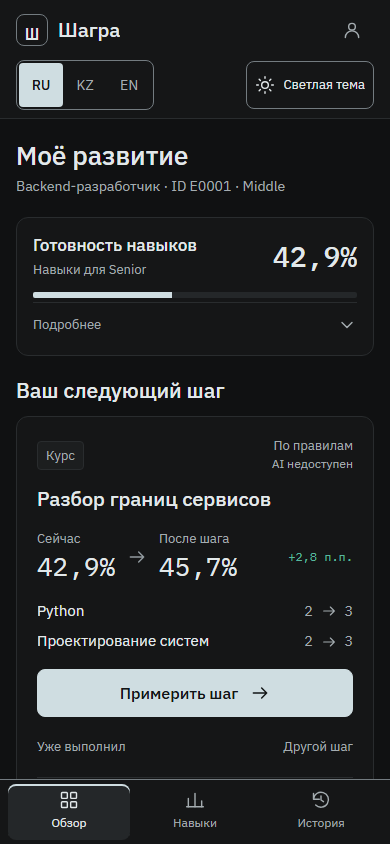
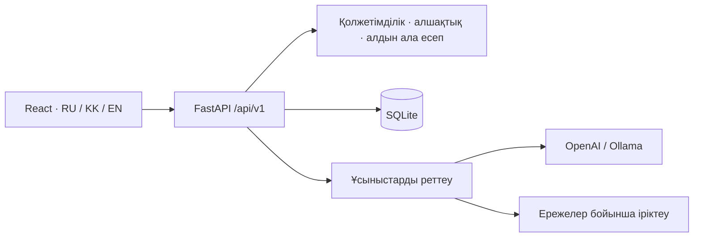

<div align="center">

# ШАҒРА · SHAGRA

### Келесі мансаптық қадамның нәтижесін алдын ала көріңіз

[Русский](README.md) · **Қазақша** · [English](README.en.md)

React · TypeScript · FastAPI · SQLite · OpenAI / Ollama

HackAlem AI · Halyk Bank трегі · Invincibles командасы

</div>

ШАҒРА қызметкерге пайдалы оқу іс-шарасын таңдауға, **оны аяқтамай тұрып есептік әсерін көруге** және баламаларды салыстыруға көмектеседі. HR дағдылардағы алшақтықтарды талдап, қызметкер профильдерін тексеру арқылы импорттай алады. Бұл — нақты API-мен жұмыс істейтін хакатондық MVP.


[Жылдам іске қосу](#жылдам-іске-қосу) · [Орнату](#әртүрлі-жүйелерге-орнату) · [Деректер](#деректер-және-импорт) · [Архитектура](#архитектура) · [Тексеру](#тексеру) · [Құжаттама](docs/README.md)

## Мүмкіндіктер

| Қызметкер үшін | HR үшін |
|---|---|
| Қазіргі және мақсатты грейд, талаптардың орындалуы | Команданың дамуы туралы жиынтық |
| Дағдылар картасы және нақты алшақтықтар | Есептеу негізі көрсетілген басым тапшылықтар |
| Каталогтан жеке ұсыныстар | Қызметкерді ID арқылы іздеу |
| Екі іс-шараның әсерін алдын ала салыстыру | Қатысу кестелері, сүзгілер, беттеу |
| Орындалуды растау және тарих | Файлдарды тексеріп, бөлек қадаммен қолдану |

**RU / KZ / EN**, ашық және қараңғы тақырыптар, компьютер мен телефонға арналған мәзір. Тіл мен тақырып браузерде сақталады. Каталог атауларының аудармасы API-дегі өрістерге байланысты: аударма болмаса, қолжетімді тілдегі атау түсіндірмемен көрсетіледі. Сервердің негіздемелері бастапқы тілінде қалады.

| HR талдауы | Телефондағы интерфейс |
|---|---|
|  |  |

Скриншоттар жұмыс істейтін қолданбада синтетикалық деректермен түсірілген. Репозиторийде банк қызметкерлерінің нақты деректері жоқ.

## Жылдам іске қосу

**Git және Docker Compose v2** қажет. Docker арқылы іске қосқанда компьютерге Python мен Node.js орнату міндетті емес. Алғашқы құрастыру кезінде тәуелділіктер жүктеледі.

```bash
git clone https://github.com/BAITC-Hacks/hack-3e883744-invincibles.git
cd hack-3e883744-invincibles
```

`.env` файлы жоқ болса, [.env.example](.env.example) үлгісінен жасаңыз.

Linux/macOS:

```bash
test -f .env || cp .env.example .env
```

Windows PowerShell:

```powershell
if (!(Test-Path .env)) { Copy-Item .env.example .env }
```

AI үшін `.env` ішіндегі `OPENAI_API_KEY` мәнін толтырыңыз. Кілтсіз ережелер бойынша іріктеу іске қосылады; интерфейс бұл режимді анық көрсетеді. Кілтті Git-ке немесе `VITE_*` айнымалыларына қоспаңыз.

```bash
docker compose up -d --build app
docker compose ps
```

**[localhost:8080](http://localhost:8080)** мекенжайын ашыңыз. [Сервер күйі](http://localhost:8080/api/v1/health) · [Swagger UI](http://localhost:8080/docs).

| Рөл | Логин | Құпиясөз |
|---|---|---|
| Қызметкер, E0001 | `employee` | `demo-employee` |
| HR | `hr` | `demo-hr` |

Бұл — демонстрациялық есептік жазбалар. Құпиясөздер `DEMO_EMPLOYEE_PASSWORD` және `DEMO_HR_PASSWORD` арқылы беріледі.

## Әртүрлі жүйелерге орнату

| Жүйе | Дайындық |
|---|---|
| Windows | WSL 2 және Linux containers режимімен [Docker Desktop](https://docs.docker.com/desktop/setup/install/windows-install/) орнатып, іске қосыңыз. Командаларды PowerShell-де орындаңыз. |
| macOS | Apple silicon немесе Intel компьютеріңізге сай [Docker Desktop](https://docs.docker.com/desktop/setup/install/mac-install/) орнатып, іске қосыңыз. Terminal қолданыңыз. |
| Linux | [Ubuntu нұсқаулығы](https://docs.docker.com/engine/install/ubuntu/) немесе өз дистрибутивіңіздің нұсқаулығы бойынша Docker Engine мен Compose plugin орнатыңыз. `docker info` және `docker compose version` тексеріңіз. |

Linux-та Docker socket үшін `permission denied` қатесі шықса, `sudo docker compose …` қолданыңыз немесе жүйеңіздің ережесіне сай рұқсаттарды баптаңыз. ОЖ мен құрылғыға қойылатын өзекті талаптар ресми сілтемелерде берілген.

### Docker-сіз: Linux / macOS

**Python 3.12** және **Node.js 22 LTS (22.19 немесе 22.x тармағындағы кейінгі нұсқа)** қажет. Жергілікті тексеруде Node.js 24 те қолданылған. Репозиторийдің түбірінен:

```bash
python3.12 -m venv .venv
.venv/bin/python -m pip install -r backend/requirements.lock
npm --prefix frontend ci
npm --prefix frontend run build
export DATABASE_PATH="$PWD/runtime/shagra.sqlite3"
export SESSION_SECRET_PATH="$PWD/runtime/session-secret"
export AI_USAGE_PATH="$PWD/runtime/ai-usage.json"
export KIT_PATH="$PWD/data/synthetic"
export FRONTEND_DIST="$PWD/frontend/dist"
export APP_ORIGIN=http://localhost:8080
export AI_PROVIDER=openai
# AI үшін OPENAI_API_KEY мәнін осы терминал ортасында орнатыңыз.
.venv/bin/python -m uvicorn app.main:app --app-dir backend --host 127.0.0.1 --port 8080
```

### Docker-сіз: Windows PowerShell

```powershell
py -3.12 -m venv .venv
.\.venv\Scripts\python.exe -m pip install -r backend/requirements.lock
npm --prefix frontend ci
npm --prefix frontend run build
$env:DATABASE_PATH = "$PWD/runtime/shagra.sqlite3"
$env:SESSION_SECRET_PATH = "$PWD/runtime/session-secret"
$env:AI_USAGE_PATH = "$PWD/runtime/ai-usage.json"
$env:KIT_PATH = "$PWD/data/synthetic"
$env:FRONTEND_DIST = "$PWD/frontend/dist"
$env:APP_ORIGIN = 'http://localhost:8080'
$env:AI_PROVIDER = 'openai'
# AI үшін OPENAI_API_KEY мәнін осы терминал ортасында орнатыңыз.
.\.venv\Scripts\python.exe -m uvicorn app.main:app --app-dir backend --host 127.0.0.1 --port 8080
```

**uvicorn тікелей іске қосылғанда `.env` автоматты түрде оқылмайды.** Баптауларды орта айнымалылары арқылы беріңіз. Кілт бос болса, резервтік есептеу қолданылады. `runtime/` бумасын қолданба жасайды. Жергілікті іске қосу мен Compose бөлек дерекқор қоймаларын пайдаланады.

## Баптау және AI

| Айнымалы | Әдепкі мән | Мақсаты |
|---|---|---|
| `APP_PORT` | `8080` | Компьютердегі Compose порты |
| `APP_ORIGIN` | `http://localhost:8080` | POST сұрауларына рұқсат етілетін нақты мекенжай |
| `AI_PROVIDER` | `openai` | `openai` немесе `ollama` |
| `OPENAI_API_KEY` | бос | Серверлік кілт; кілтсіз резервтік режим жұмыс істейді |
| `OPENAI_MODEL` | `gpt-4.1-mini-2025-04-14` | Ұсыныстарды реттейтін модель |
| `AI_MAX_PAID_CALLS` | `2000` | API әрекеттерінің шегі, долларлық бюджет емес |
| `LLM_TIMEOUT_SECONDS` | `8` | Модельді күту уақыты |
| `OLLAMA_MODEL` | `qwen2.5:1.5b` | Жергілікті модель |
| `COOKIE_SECURE` | `false` | Жергілікті HTTP; HTTPS үшін secure cookie қажет |

Портты өзгерткенде **екі** мәнді де жаңартыңыз: мысалы, `APP_PORT=8081` және `APP_ORIGIN=http://localhost:8081`. `localhost` пен `127.0.0.1` — әртүрлі origin.

Ollama үшін `.env` ішінде `AI_PROVIDER=ollama` және `OLLAMA_BASE_URL=http://ollama:11434` орнатыңыз:

```bash
docker compose --profile local-ai up -d --build
docker compose logs -f model-init
```

Бірінші іске қосу модельді жүктейді және қосымша ресурстарды қажет етеді. Модель дайын болғанша резервтік режим қолданылуы мүмкін. AI рұқсат етілген нұсқаларды реттейді; әсерді есептеу, қолжетімділікті анықтау және нәтижені сақтау сервер ережелерімен орындалады. [AI туралы](docs/AI.md).

## Деректер және импорт

**200 қызметкер · 40 іс-шара · 60 дағды · 24 айдағы 1736 тарих жазбасы.** Команданың синтетикалық жинағын қайта жасауға болады: seed `20260923`, нұсқа `shagra-kit/1`.

| `data/synthetic/` ішіндегі файл | Мазмұны |
|---|---|
| `employees.json` | Қызметкерлердің қазіргі профильдері мен дағды деңгейлері |
| `events.json` | Іс-шаралар, аудитория және әсер |
| `skills.json` | Дағдылар, рөлдер және грейд талаптары |
| `activity_history.csv` | Қатысу тарихы |
| `manifest.json` | Деректердің шығу тегі мен бақылау сомалары |

HR **employees.json + activity_history.csv** жүктейді, әрқайсысы 5 MiB-тан аспауы керек. Тексеру мен қолдану — бөлек қадамдар. ID сәйкес келсе, дағдыларды қоса алғанда бүкіл профиль ауыстырылады; тарих жазба ID-і бойынша біріктіріледі. Тексеру 15 минут жарамды. Белгісіз дағды нөл болып саналмайды; импортталған тарих дағды өсімін қайта қоспайды. [Жинақ схемасы](data/synthetic/README.md) · [Импорт ережелері](docs/DATA.md).

## Архитектура



Frontend пен API бір origin арқылы беріледі. HttpOnly cookie сессияны сақтайды; нұсқалар ескірген әрекеттерден қорғайды; Idempotency-Key нәтижені екі рет есептеуге жол бермейді. Контейнерде бір worker жұмыс істейді, дерекқор мен сессия құпиясы тұрақты volume ішінде сақталады.

```text
backend/app/       API, ережелер, ұсыныстар, SQLite
frontend/src/      app → pages → features / entities → shared
contracts/         OpenAPI және мысалдар
data/             синтетикалық жинақ пен AI сценарийлері
tools/            деректерді тексеру, схемалар, AI бағалау
docs/             құжаттама, дизайн және тексеру нәтижелері
```

## Тексеру

Тәуелділіктерді орнатқаннан кейін; Windows-та `.venv/bin/python` орнына `.\.venv\Scripts\python.exe` қолданыңыз:

```bash
.venv/bin/python -m pytest -q
.venv/bin/python tools/validate_kit.py
.venv/bin/python -m pip check
npm --prefix frontend run build
cd frontend
npx playwright install chromium firefox webkit
npm run test:e2e
```

Linux-та [Playwright жүйелік тәуелділіктері](https://playwright.dev/docs/browsers) қажет болуы мүмкін: `npx playwright install --with-deps`. Live-тест **деректерді өзгертеді**: тек бөлек тестілік дерекқор мен дұрыс `LIVE_BASE_URL` қолданыңыз. [Нұсқаулық пен нәтижелер](docs/TESTING.md).

`3eb7a86` ревизиясының соңғы тексеруінде 42 backend-тест, 21 Chromium сценарийі және бір live-сценарий өтті. Алғашқы параллель UI тексеруінде бір кіру таймауты болды; бөлек және тізбекті қайталауларда ол қайталанбады. Нақты OpenAI Q1–Q3 сценарийлері алдыңғы аудитте өтті. Аудит ортасында Docker daemon-ға рұқсат жоқ; бұл нәтижелер контейнердің немесе барлық ОЖ-ның тексерілгенін білдірмейді.

## Жаңарту және ақауларды шешу

```bash
git pull --ff-only
docker compose up -d --build app
docker compose logs --tail=100 app
```

Тоқтату: `docker compose stop`. Қайта құрастыру volume-ды сақтайды. **Қазіргі деректер керек болса, `docker compose down -v` қолданбаңыз.**

| Белгі | Шешімі |
|---|---|
| Сұрау көзі жарамсыз | Нақты APP_ORIGIN ашыңыз; `.env` өзгерген соң контейнерді қайта жасаңыз |
| Ескі дизайн көрінеді | Image-ді қайта құрастырып, Ctrl+Shift+R / Cmd+Shift+R басыңыз |
| Ережелер бойынша ұсыныстар | Кілтті, провайдерді және health ішіндегі model_status мәнін тексеріңіз |
| STALE_CONTEXT / IMPORT_CONFLICT / IMPORT_EXPIRED | Профильді жаңартыңыз немесе файлдарды қайта тексеріңіз |
| Docker қолжетімсіз | Docker Desktop/daemon іске қосып, `docker info` мен рұқсаттарды тексеріңіз |

Vite арқылы әзірлеу үшін backend-ті 8080 портында `APP_ORIGIN=http://localhost:5173` мәнімен іске қосыңыз, содан кейін `npm --prefix frontend run dev` орындап, дәл `http://localhost:5173` ашыңыз. Қалыпты билд үшін origin-ді 8080-ге қайтарыңыз.

## Құжаттама және MVP шектеулері

- [Құжаттама тізімі](docs/README.md) · [Үш минуттық демо](docs/DEMO.md).
- [API және қателер](contracts/README.md) · [OpenAPI](contracts/openapi.json).
- [Архитектура](docs/ARCHITECTURE.md) · [Деректер](docs/DATA.md) · [AI](docs/AI.md) · [Тексеру](docs/TESTING.md).
- [Компоненттер, лицензиялар және дереккөздер](THIRD_PARTY.md). Жобаның жалпы лицензиясы әлі жарияланбаған.

Бұл — жергілікті демонстрациялық MVP. Дағдылардың талаптарға сәйкестігі қызметкерді жоғарылату туралы шешім емес; ұйымдастырушылардың ресми жинағымен үйлесімділік тексерілмеген. Кейбір серверлік негіздемелерде enum атаулары бар; HR жауаптарының бір бөлігінде рөл атаулары жоқ. `docs/validation/ui/redesign` және `start-design.sh` — тарихи алдын ала қарау материалдары, жұмыс қолданбасына қажет емес. `.env`, runtime дерекқорлары мен орнатылған тәуелділіктер Git-ке қосылмайды.
