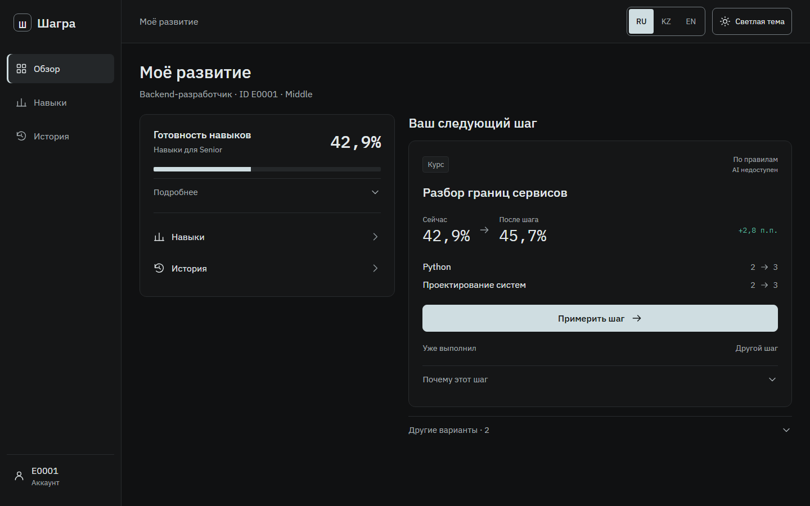
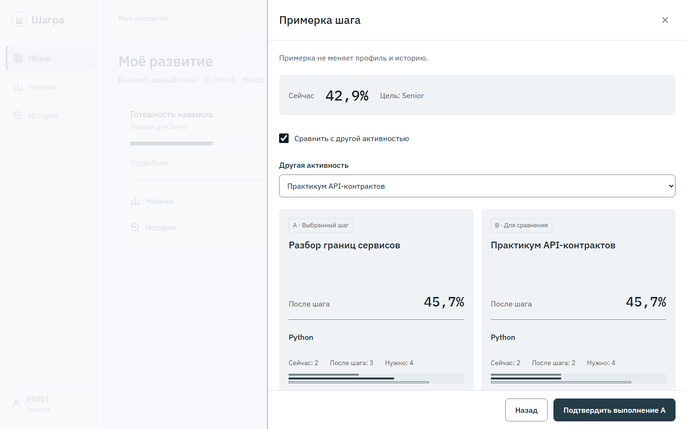
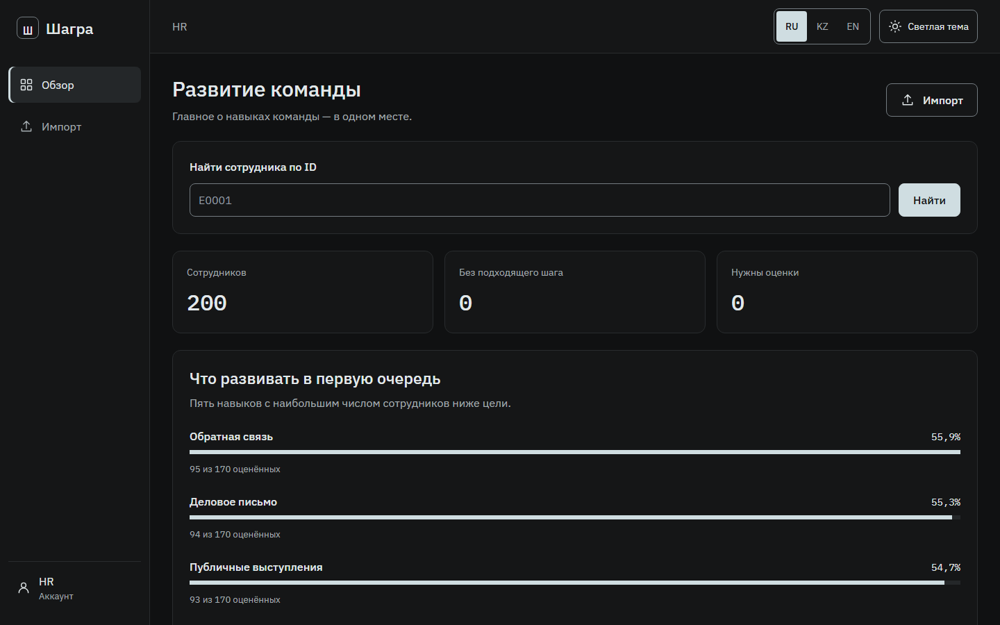
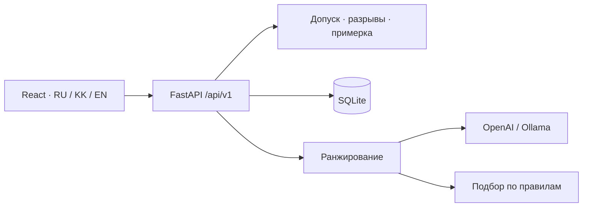

<div align="center">


# ШАГРА

### Следующий карьерный шаг — с понятным результатом

**Русский** · [Қазақша](README.kk.md) · [English](README.en.md)


</div>

> **ШАГРА превращает профиль сотрудника, требования следующего грейда и историю развития в проверяемый план карьерного шага.** Эффект каждой активности можно увидеть и сравнить до её выполнения.

Сотрудник видит разрывы навыков и обоснованные рекомендации, а HR — сводку команды и безопасный импорт профилей. Все расчёты выполняет настоящий API; AI ранжирует варианты, но не подменяет факты.

<div align="center">

[🚀 Запустить](#быстрый-старт) · [✨ Возможности](#возможности) · [🤖 Режимы AI](#проверка-для-жюри) · [🏗 Архитектура](#архитектура) · [📚 Документация](docs/README.md)

</div>

## Продукт в действии



| Сравнение карьерных активностей | HR-аналитика |
|---|---|
|  |  |

## Чем отличается

| Контекст вместо общего совета | Проверяемый результат | Три режима демонстрации |
|---|---|---|
| Учитывает грейд, конкретные пробелы и историю сотрудника | Показывает источник рекомендации и прогноз изменения навыков до подтверждения | OpenAI API, локальная Ollama или полностью готовый fallback без ключа |

## Возможности

| Сотрудник | HR |
|---|---|
| Текущий и целевой грейд, покрытие требований | Сводка развития команды |
| Карта навыков и конкретные разрывы | Приоритетные дефициты с понятными знаменателями |
| Персональные рекомендации из каталога | Поиск сотрудника по ID |
| Примерка и сравнение двух активностей | Таблицы участия, фильтры, пагинация |
| Подтверждение выполнения и история | Проверка файлов перед отдельным применением |

**RU / KZ / EN**, светлая и тёмная темы, desktop и мобильное меню. Язык и тема сохраняются в браузере. Переводы названий зависят от каталога: при отсутствии перевода показывается доступный язык с пояснением. Обоснования сервера остаются на языке источника.

Скриншоты рабочего приложения получены на синтетических данных. Реальных данных сотрудников банка в репозитории нет.

## Быстрый старт

Нужны **Git и Docker Compose v2**. Python и Node.js на хосте не требуются. Первая сборка скачивает зависимости.

```bash
git clone https://github.com/BAITC-Hacks/hack-3e883744-invincibles.git
cd hack-3e883744-invincibles
```

Создайте `.env` из [.env.example](.env.example), если файла ещё нет.

Linux/macOS:

```bash
test -f .env || cp .env.example .env
```

Windows PowerShell:

```powershell
if (!(Test-Path .env)) { Copy-Item .env.example .env }
```

Для AI заполните `OPENAI_API_KEY` в `.env`. Без ключа работает подбор по правилам, явно обозначенный в интерфейсе. Ключ нельзя помещать в Git или `VITE_*`.

```bash
docker compose up -d --build app
docker compose ps
```

Откройте **[localhost:8080](http://localhost:8080)**. [Проверка сервера](http://localhost:8080/api/v1/health) · [Swagger UI](http://localhost:8080/docs).

| Роль | Логин | Пароль |
|---|---|---|
| Сотрудник, E0001 | `employee` | `demo-employee` |
| HR | `hr` | `demo-hr` |

Это демонстрационные учётные записи. Пароли задаются через `DEMO_EMPLOYEE_PASSWORD` и `DEMO_HR_PASSWORD`.

## Установка на разных системах

| Система | Подготовка |
|---|---|
| Windows | Установите [Docker Desktop](https://docs.docker.com/desktop/setup/install/windows-install/) с WSL 2 и Linux containers, запустите его. Команды выполняйте в PowerShell. |
| macOS | Установите [Docker Desktop](https://docs.docker.com/desktop/setup/install/mac-install/) под Apple silicon или Intel, запустите его. Используйте Terminal. |
| Linux | Установите Docker Engine и Compose plugin: [Ubuntu](https://docs.docker.com/engine/install/ubuntu/) или инструкция своего дистрибутива. Проверьте `docker info` и `docker compose version`. |

При `permission denied` для Docker socket на Linux используйте `sudo docker compose …` либо настройте доступ по правилам своей системы. Актуальные требования к ОС и оборудованию — по официальным ссылкам выше.

### Без Docker: Linux / macOS

Нужны **Python 3.12** и **Node.js 22 LTS (22.19 или новее в ветке 22)**. Node.js 24 также использовался при проверке. Из корня проекта:

```bash
python3.12 -m venv .venv
.venv/bin/python -m pip install -r backend/requirements.lock
npm --prefix frontend ci
npm --prefix frontend run build
export DATABASE_PATH="$PWD/runtime/shagra.sqlite3"
export SESSION_SECRET_PATH="$PWD/runtime/session-secret"
export AI_USAGE_PATH="$PWD/runtime/ai-usage.json"
export KIT_PATH="$PWD/data/synthetic"
export FRONTEND_DIST="$PWD/frontend/dist"
export APP_ORIGIN=http://localhost:8080
export AI_PROVIDER=openai
# Для AI задайте OPENAI_API_KEY в окружении терминала.
.venv/bin/python -m uvicorn app.main:app --app-dir backend --host 127.0.0.1 --port 8080
```

### Без Docker: Windows PowerShell

```powershell
py -3.12 -m venv .venv
.\.venv\Scripts\python.exe -m pip install -r backend/requirements.lock
npm --prefix frontend ci
npm --prefix frontend run build
$env:DATABASE_PATH = "$PWD/runtime/shagra.sqlite3"
$env:SESSION_SECRET_PATH = "$PWD/runtime/session-secret"
$env:AI_USAGE_PATH = "$PWD/runtime/ai-usage.json"
$env:KIT_PATH = "$PWD/data/synthetic"
$env:FRONTEND_DIST = "$PWD/frontend/dist"
$env:APP_ORIGIN = 'http://localhost:8080'
$env:AI_PROVIDER = 'openai'
# Для AI задайте OPENAI_API_KEY в окружении терминала.
.\.venv\Scripts\python.exe -m uvicorn app.main:app --app-dir backend --host 127.0.0.1 --port 8080
```

**Прямой запуск uvicorn автоматически не читает `.env`.** Передайте настройки через окружение. Пустой ключ включает fallback. `runtime/` создаётся приложением. Локальный запуск и Compose используют разные хранилища БД.

## Проверка для жюри

[Готовая инструкция для эксперта](docs/JURY.md): живой OpenAI с приватным тестовым ключом, локальная Ollama без аккаунта и подготовленный офлайн-сценарий. Для третьего варианта ключ не нужен, платные вызовы отключены:

```bash
docker compose --env-file config/jury-offline.env -p shagra-jury -f compose.yaml -f compose.offline.yaml up -d --build app
```

Откройте **http://localhost:8081**. Отдельный том сохраняет демонстрацию независимо от основного приложения. Это подбор **«По правилам»**, не живой AI. [Четыре готовых профиля для импорта](data/demo-import/README.md) показывают полезный шаг, достигнутую цель, последний грейд и отсутствие оценки.

## Конфигурация и AI

| Переменная | По умолчанию | Назначение |
|---|---|---|
| `APP_PORT` | `8080` | Порт Compose на компьютере |
| `APP_ORIGIN` | `http://localhost:8080` | Точный адрес страницы для POST-запросов |
| `AI_PROVIDER` | `openai` | `openai` или `ollama` |
| `OPENAI_API_KEY` | пусто | Серверный ключ; без него работает fallback |
| `OPENAI_MODEL` | `gpt-4.1-mini-2025-04-14` | Модель ранжирования |
| `AI_MAX_PAID_CALLS` | `2000` | Лимит попыток API, не долларовый бюджет |
| `LLM_TIMEOUT_SECONDS` | `8` | Время ожидания модели |
| `OLLAMA_MODEL` | `qwen2.5:1.5b` | Локальная модель |
| `COOKIE_SECURE` | `false` | Для локального HTTP; HTTPS требует secure cookies |

Другой порт требует изменить **оба** значения, например `APP_PORT=8081` и `APP_ORIGIN=http://localhost:8081`. `localhost` и `127.0.0.1` — разные origin.

Для Ollama задайте в `.env` `AI_PROVIDER=ollama` и `OLLAMA_BASE_URL=http://ollama:11434`:

```bash
docker compose --profile local-ai up -d --build
docker compose logs -f model-init
```

Первый запуск скачивает модель и требует дополнительных ресурсов. До её готовности допустим fallback. AI ранжирует допустимые варианты; эффект, допуск и запись результата определяются серверными правилами. [Подробнее об AI](docs/AI.md).

## Данные и импорт

**200 сотрудников · 40 активностей · 60 навыков · 1736 записей истории за 24 месяца.** Это воспроизводимый синтетический кит команды: seed `20260923`, версия `shagra-kit/1`.

| Файл в `data/synthetic/` | Содержание |
|---|---|
| `employees.json` | Текущие профили и уровни навыков |
| `events.json` | Активности, аудитория, эффект |
| `skills.json` | Навыки, роли, требования грейдов |
| `activity_history.csv` | История участия |
| `manifest.json` | Происхождение и контрольные суммы |

HR загружает **employees.json + activity_history.csv**, до 5 MiB каждый. Проверка и применение разделены. Совпавший ID полностью заменяет профиль, включая навыки; история объединяется по ID записи. Проверка действует 15 минут. Неизвестный навык не считается нулевым; импорт истории не начисляет эффект повторно. [Схема кита](data/synthetic/README.md) · [Правила импорта](docs/DATA.md).

## Архитектура



Frontend и API обслуживаются с одного origin. HttpOnly cookie хранит сессию; версии защищают от устаревших операций; Idempotency-Key предотвращает повторное начисление. В контейнере один worker, БД и секрет сессий сохраняются в volume.

```text
backend/app/       API, правила, рекомендации, SQLite
frontend/src/      app → pages → features / entities → shared
contracts/         OpenAPI и примеры
data/             синтетический кит и AI-сценарии
tools/            проверки данных, схемы, AI-оценка
docs/             документация, дизайн, результаты проверок
```

## Проверки

После установки зависимостей; на Windows замените `.venv/bin/python` на `.\.venv\Scripts\python.exe`:

```bash
.venv/bin/python -m pytest -q
.venv/bin/python tools/validate_kit.py
.venv/bin/python -m pip check
npm --prefix frontend run build
cd frontend
npx playwright install chromium firefox webkit
npm run test:e2e
```

На Linux могут понадобиться [системные зависимости Playwright](https://playwright.dev/docs/browsers), устанавливаемые через `npx playwright install --with-deps`. Live-тест **изменяет данные**: только отдельная тестовая БД и правильный `LIVE_BASE_URL`. [Как запускать и что проверено](docs/TESTING.md).

На ревизии `3eb7a86`: 42 backend-теста, 21 Chromium-сценарий и 1 live-сценарий прошли на финальном прогоне. Первый параллельный UI-прогон дал один таймаут входа, не повторившийся отдельно и последовательно. Реальные Q1–Q3 OpenAI прошли в предыдущем аудите. Docker daemon в среде проверки недоступен по правам; это не проверка контейнера или всех ОС.

## Обновление и помощь

```bash
git pull --ff-only
docker compose up -d --build app
docker compose logs --tail=100 app
```

Остановка: `docker compose stop`. Пересборка сохраняет volume. **Не используйте `docker compose down -v`, если нужны текущие данные.**

| Симптом | Решение |
|---|---|
| Недопустимый источник запроса | Открыть точный APP_ORIGIN; после изменения `.env` пересоздать контейнер |
| Старый дизайн | Пересобрать image, обновить страницу Ctrl+Shift+R / Cmd+Shift+R |
| «По правилам» | Проверить ключ, провайдера и model_status в health |
| STALE_CONTEXT / IMPORT_CONFLICT / IMPORT_EXPIRED | Обновить профиль или повторить проверку файлов |
| Docker недоступен | Запустить Docker Desktop/daemon, проверить `docker info` и права |

Для Vite-разработки backend запускается на 8080 с `APP_ORIGIN=http://localhost:5173`; затем `npm --prefix frontend run dev` и именно `http://localhost:5173`. Для обычного билда верните origin 8080.

## Документация и границы MVP

- [Навигатор](docs/README.md) · [Демо за 3 минуты](docs/DEMO.md).
- [API и ошибки](contracts/README.md) · [OpenAPI](contracts/openapi.json).
- [Архитектура](docs/ARCHITECTURE.md) · [Данные](docs/DATA.md) · [AI](docs/AI.md) · [Проверки](docs/TESTING.md).
- [Компоненты, лицензии и источники](THIRD_PARTY.md). Общая лицензия проекта пока не объявлена.

Это локальный демонстрационный MVP. Покрытие навыков не является решением о повышении; совместимость с официальным китом организаторов не подтверждена. HR API не везде содержит названия ролей; серверные объяснения пока остаются на русском языке. Макеты в `docs/validation/ui/redesign` и `start-design.sh` — исторический предпросмотр, для рабочего приложения они не нужны. `.env`, runtime-БД и зависимости не включаются в Git.
