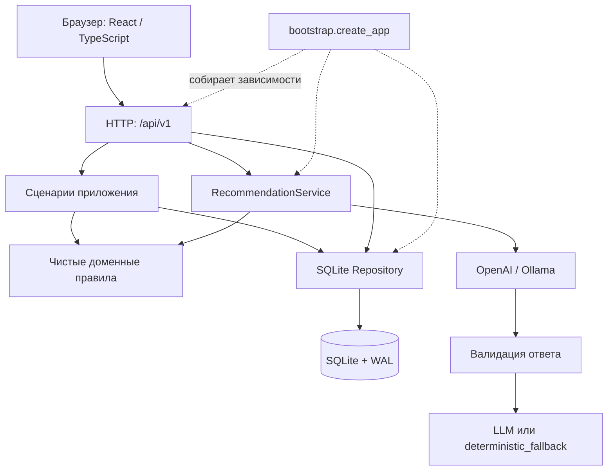

# Архитектура ШАГРЫ

[Документация](README.md) · [Русский](../README.md) · [Қазақша](../README.kk.md) · [English](../README.en.md)

ШАГРА — модульный монолит: React-клиент, FastAPI-сервер, SQLite и заменяемый провайдер ранжирования. Один процесс обслуживает API и собранные статические файлы с одного origin. Разделение модулей позволяет менять интерфейс, правила, хранение и AI независимо; распределённый запуск пока не реализован.

## Границы модулей

| Путь | Ответственность |
|---|---|
| [`backend/app/contracts`](../backend/app/contracts/) | Pydantic-модели домена, запросов и ответов; источник OpenAPI |
| [`backend/app/core`](../backend/app/core/) | Допуск, требования грейда, покрытие, примерка и агрегаты истории; без HTTP и БД |
| [`backend/app/application`](../backend/app/application/) | Сборка профиля и HR-сводки, проверка и применение импорта |
| [`backend/app/data`](../backend/app/data/) | Адаптер кита v1, ссылки, SQLite, транзакции и версии |
| [`backend/app/recommendations`](../backend/app/recommendations/) | Кандидаты, AI-провайдеры, проверка вывода, кэш и лимит платных попыток |
| [`backend/app/http/routes.py`](../backend/app/http/routes.py) | HTTP, права, Origin, преобразование запросов в вызовы сценариев |
| [`backend/app/bootstrap.py`](../backend/app/bootstrap.py) | Создание БД, сессий, сервисов, startup-probe и раздача frontend |

HTTP-слой текущего MVP обращается к repository напрямую для чтения контекста, сессий и атомарного completion. Расчётные правила остаются в core. Модель не имеет доступа к БД и получает уже подготовленный контекст кандидатов.

Frontend организован как `app → pages → features / entities → shared`:

- `app`: маршрутизация, восстановление сессии, общий каркас и меню.
- `pages`: вход, профиль/навыки/история, HR, импорт.
- `features`: рекомендации, примерка, подтверждение выполнения, загрузка файлов.
- `entities`: отображение навыков и карты.
- `shared`: HTTP-клиент, типы, переводы, форматирование, UI-компоненты, токены и локальные шрифты.

Действующая точка входа стилей — [`shared/styles/global.css`](../frontend/src/shared/styles/global.css). Она подключает шрифты из `shared/styles/fonts`. Настройки языка и темы сохраняются в localStorage. Расчёт эффекта, проверка доступа и правила начисления выполняются на сервере. Совместимые импорты `src/api.ts` и `src/types.ts` сохранены для существующих потребителей.

## Основной сценарий

1. Вход создаёт серверную сессию на восемь часов. Браузер получает подписанный идентификатор в `HttpOnly`, `SameSite=Strict` cookie. Сотрудник читает свой профиль; HR имеет доступ к сводке, импорту и профилям команды.
2. Профиль возвращает `employee_version` и `dataset_version`. Неизвестные уровни остаются неизвестными. Покрытие требований отражает состояние навыков, а не вероятность повышения.
3. Рекомендации отбирают допустимые полезные события. Модель упорядочивает shortlist и возвращает разрешённые коды оснований. Сервер проверяет ответ; при сбое выдаёт явный `deterministic_fallback`.
4. Примерка использует те же правила начисления, что выполнение, и ничего не записывает. Два варианта сравниваются с одним исходным snapshot.
5. Выполнение требует версии и `Idempotency-Key`. Транзакция повторно проверяет допуск, записывает историю, обновляет навыки и версии. Повтор с тем же ключом и телом возвращает сохранённый результат; несовместимое повторение отклоняется.
6. После записи клиент обновляет профиль и рекомендации. Изменившиеся версии вызывают `STALE_CONTEXT`; клиент должен перечитать состояние.

Все POST-запросы, включая вход, рекомендации и примерку, требуют точного `Origin` или подходящего `Referer`. Поэтому `localhost` и `127.0.0.1` не взаимозаменяемы. Подробные коды ошибок описаны в [HTTP-контракте](../contracts/README.md).

## Импорт и хранение

В новую БД загружается [синтетический кит](../data/synthetic/README.md). Повторный старт не сбрасывает данные. SQLite работает в WAL-режиме; запись выполнения и применение импорта атомарны. Исторические записи из кита не начисляют навыки повторно.

HR передаёт `employees.json` и `activity_history.csv`, до 5 MiB каждый. Проверка сохраняет нормализованную заявку на 15 минут. Применение проверяет владельца заявки и версию датасета. Совпадающий профиль заменяется полным snapshot; история объединяется по идентификаторам. Повторное применение успешно завершённой заявки не изменяет данные.

| Данные | Compose | Локальный запуск по README |
|---|---|---|
| БД, сессии, заявки импорта | volume `runtime`, `/app/runtime/shagra.sqlite3` | `runtime/shagra.sqlite3` |
| Секрет подписи сессий | `/app/runtime/session-secret` | `runtime/session-secret` |
| Счётчик платных попыток AI | `/app/runtime/ai-usage.json` | `runtime/ai-usage.json` через `AI_USAGE_PATH` |
| Модель Ollama | volume `ollama-models` | Зависит от установки Ollama |
| Ключ OpenAI | Окружение backend из `.env` | Окружение процесса |

Кэш рекомендаций хранится в памяти: до 500 записей, 15 минут для LLM-результата и 15 секунд для fallback. Ключ включает версии контекста, предпочтение, исключения, провайдера, модель и версию prompt. Ключ OpenAI не передаётся в frontend.

## Сборка и развитие

[Dockerfile](../Dockerfile) собирает frontend в Node.js и переносит только `dist` в Python-образ. Финальный контейнер работает от пользователя `shagra`; Compose привязывает порт к `127.0.0.1`. `.dockerignore` исключает зависимости хоста, секреты, runtime, тестовые отчёты, макеты и документацию из контекста сборки.

Текущая схема рассчитана на один worker. Для расширения сначала нужны миграции БД и резервное копирование, затем PostgreSQL при подтверждённой нагрузке, общее хранилище кэша и межпроцессная синхронизация AI-лимитера. Несколько worker без этих изменений нарушают предположения о лимитах. Для корпоративного внедрения отдельно нужны SSO, роли организации и согласованная обработка реальных данных. Это направления развития, не реализованные функции MVP.

Официальный кит подключается отдельным адаптером в `data`, после проверки его схемы. Новый AI-провайдер должен сохранять контракт ранжирования и серверную проверку вывода. Изменение доменных правил требует backend-тестов; изменение HTTP-контракта — обновления OpenAPI, примеров и frontend-типов.
